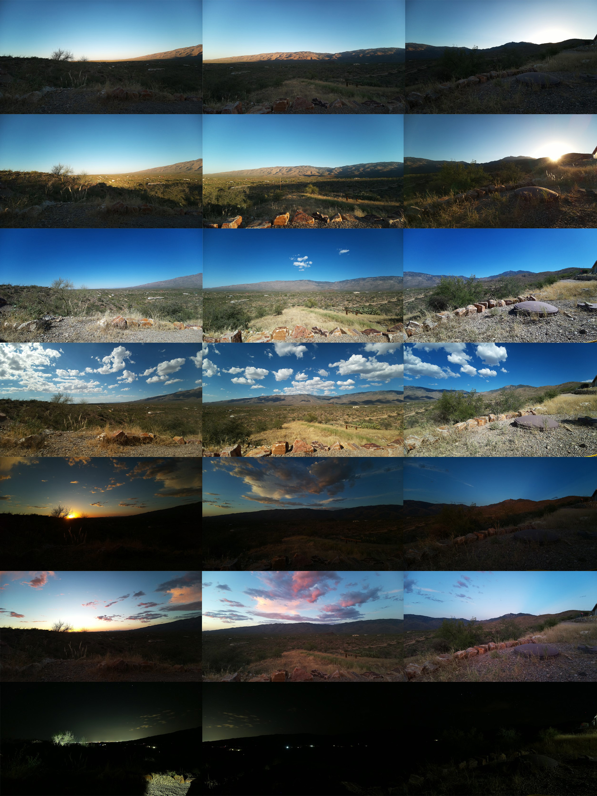

## Pi Sliced Day Photos

This is a small .NET Core (C#) program designed to be run on a Raspberry Pi that takes photographs at Sunrise, Sunset, a number intervals in-between and at custom times specified either by clock time or minutes +/- from sunrise/sunset.

The sunrise/sunset times must be provided to the program as a CSV file - a number of libraries/APIs are available to calculate sunrise/sunset at a particular location but taking the sunrise/sunset times from a file leaves you free to calculate them in whatever way you prefer. One of the most useful examples is generating the sunrise/sunset time considering  local topography - the sun on an imagined horizon is not photographically useful or interesting, when the sun rises behind a mountain peak is much more interesting.

The in-between intervals are calculated based on sunrise/sunset times provided as a CSV file. Since the provided sunrise/sunset times may take topography (or other factors) into account the photographs might not be at the same sun angle each day, but will be at the same relative time between sunrise/sunset.

Living in the shadow of a mountain peak inspired this setup, 'halfway thru the available sunlight for the day' is much more interesting to me than a photo taken at a certain clock time or sun angle...

For this program to work it requires:
 - A Raspberry Pi where .NET Core can run and an attached camera that responds to libcamera-still. This program has only been confirmed to run on a Raspberry Pi 3 A+ with a Camera Module 3 Wide - but I believe any 2+ version Pis with current versions of the Raspberry Pi OS should work with any of the official Pi camera modules.
 - A settings file named PiSlicedDaySettings.json - an example is included in the code and there are notes below
 - A CSV file named SunriseAndSunset.csv with the calendar day, sunrise time (local) and sunset time (local).

Sunrise and Sunset are always photographed - you can also specify:
 - How many photographs you want between Sunrise and Sunset (during the day - 0 is valid)
 - How many photographs you want between Sunset and Sunrise (during the night - 0 is valid)
 - Times relative to sunrise and sunset - for example Sunrise-10 for a photograph 10 minutes before Sunrise or Sunset+10 for a photograph 10 minutes after Sunset.
 - Clock Times

The image below was created in Photoshop by combining the output of this program from 3 Raspberry Pi 3 A+ computers with Wide Angle Camera Module 3 cameras - the cameras face, approximately, west, north and east




### SunriseAndSunset.csv

This program uses a file of Sunrise/Sunset times to allow you to input any sunrise/sunset times that you want - a strong use case for this is generating topography compensated Sunrise/Sunset times for your location. For example, today at my house we didn't see the sun come over the mountains to the east until 40+ minutes after the sunrise time calculated for the 'true' (imagined) horizon...

The SunriseAndSunset.csv file should be formatted like the sample file included with the program:
```
DAY, SUNRISE, SUNSET
2023-01-01,08:15:00-0700,17:23:00-0700
2023-01-02,08:15:00-0700,17:24:00-0700
```

If you are interested in generating Topography compensated Sunrise/Sunset times for your location try:
  - [gvellut/tppss: Compute sunrise / sunset times taking into account local topography](https://github.com/gvellut/tppss) - this is a great free way to generate the times - it does take some setup, but like me you might find preparing the data for the program is an interesting project!
  - [Find Your Location and Compute Sunlight Conditions](https://www.suncurves.com/en/) - a paid service that will do this for you.
  - Various photography apps can calculate/show you this information but I'm not sure if any of them export yearly (or multi-year) data...


### Settings File

_DaySlices_ - Takes an integer and determines the number of photos taken between sunrise and sunset.

_NightSlices_ - Takes an integer and determines the number of photos taken between sunset and sunrise.

_PhotoStorageDirectory_ - The path to where the photos are written.

_SunriseSunsetCsvFile_ - The name (including extension) of the csv file of Sunrise and Sunset times.

_PhotoNamePrefix_ - Prefix for the photo names. The date and time will follow the prefix and .jpg to create the filename. It is especially useful to change this if you have multiple cameras running.

_LogFullExceptionsToImages_ - The assumption is that this program will run largely unattended and that most of the time the only thing you will see is the photographs. The program will try to alert you of errors by writing exception information to an image file in the PhotoStorageDirectory. This setting determines whether the program writes all of the exception information or only an abbreviated message. This option exists because writing full exception information may leak information about your setup!

_LibCameraParameters_ - Day/Night/Sunset/Sunrise - command line parameters for libcamera-still.

_CustomTimes_ - Custom times can be specified either as clock times (3:45 pm) or as minutes before/after sunset (sunset +10). Each custom time also gets LibCamera parameters.

```
"CustomTimes": [
    {
      "Time": "Sunset+10",
      "LibCameraParameters": "--autofocus-mode manual --lens-position 0 --awb auto --metering average --denoise cdn_hq"
    },
    {
      "Time": "Sunrise-10",
      "LibCameraParameters": "--autofocus-mode manual --lens-position 0 --awb auto --metering average --denoise cdn_hq"
    }
  ]
```


### Setup Notes

Suggested setup on the Pi - this is here for convenience and was last updated July 2024. As OS and Pi details change some/most/all of this might become irrelevant, or even harmful, and this by no means covers all the details needed to run a Pi securely and appropriately. The setup below is pretty basic, but use at your own risk!
 - I haven't had any issues with older packages in my own installs, but certainly if the Pi is going to be dedicated to PiSlicedDayPhotos I would suggest running 'sudo apt-get update' and 'sudo apt-get upgrade' before installing the program.
 - In your home directory - make a directory for the program and the photos:
	```
	mkdir PiSlicedDayPhotos
	mkdir SlicedPhotos
	```
	- 
 - Copy the published output of this solution into the PiSlicedDayPhotos folder - then change the permissions for the program to be executable:
	```
	chmod +x PiSlicedDayPhotos/PiSlicedDayPhotos
	```
	- 
 - You will probably want to change the settings for the program:
	```
	nano PiSlicedDayPhotos/PiSlicedDaySettings.json
	```
	- 
 - Run the program as a service: Edit the pisliceddayphotos.service replacing [Your Directory Here], copy it to /etc/systemd/system/, start and follow the service to check for any errors:
	```
	nano PiSlicedDayPhotos/pisliceddayphotos.service
	sudo cp PiSlicedDayPhotos/pisliceddayphotos.service /etc/systemd/system/
	sudo systemctl daemon-reload
 	sudo systemctl enable pisliceddayphotos --now
	journalctl -u pisliceddayphotos -f
	```

I like to disable the LEDs to make sure that the glass covering the lens opening won't pick up any light from the LEDS - [How To Easily Disable Status LEDs On RaspberryTips](https://raspberrytips.com/disable-leds-on-raspberry-pi/)
  ```
  sudo nano /boot/firmware/config.txt
  ```
  Add the following lines to the end of the file:
  ```
  #Disable Power LED (Red)
  dtparam=pwr_led_activelow=off
  #Disable Activity LED (Green)
  dtparam=act_led_trigger=none
  dtparam=act_led_activelow=off
  #Disable LAN LEDs
  dtparam=eth_led0=14
  dtparam=eth_led1=14
  # Disable the ACT LED
  ```

My preference is for Automatic/Unattended Upgrades - do this long enough and something unexpected will break, but I would rather stay up to date and have something break sooner rather than later. [Secure your Raspberry Pi by enabling automatic software updates – Sean Carney](https://www.seancarney.ca/2021/02/06/secure-your-raspberry-pi-by-enabling-automatic-software-updates/) and [UnattendedUpgrades - Debian Wiki](https://wiki.debian.org/UnattendedUpgrades)
	```
	sudo apt-get update
	sudo apt-get install unattended-upgrades
	sudo dpkg-reconfigure --priority=low unattended-upgrades
	```

I use two csx script files: RedeployPiSlicedDayPhotos.csx to help re-deploy the program (useful for development work and updating multiple Pis) and SftpPiSlicedDayPhotosToLocalDirectory.csx to copy the photos from the Pis to a central computer. These are included in the repository and there are comments in the files with notes on setting up for and running these scripts. I run both via the [PointlessWaymarks Powershell Runner](https://github.com/cmiles/PointlessWaymarksProject/tree/main/PointlessWaymarks.PowershellRunnerGui) to make it easy to schedule, save in one location and to have the commandline arguments saved with appropriate security.

If you've worked in years gone by with the Pi Camera and C# you might know the very useful [techyian/MMALSharp: C# wrapper to Broadcom's MMAL with an API to the Raspberry Pi camera](https://github.com/techyian/MMALSharp) - unfortunately without choosing an older version of Raspberry Pi OS that library no longer works. The Pi has moved on to [libcamera](https://libcamera.org/). I didn't find a C# wrapper for libcamera and since I didn't need to do anything other than write stills to the Pi's storage calling libcamera-still 'command line style' seemed to be the best option.

I didn't find a single great place for libcamera-still documentation - frustrating until I figured out that (beyond 'getting started' content) running 'libcamera-still --help' was really the best single source of information.

### July 2024 Update

I have been running 3 Raspberry Pi 3 A+ computers with the Wide Angle Camera Module 3 cameras for over 6 months now - the PiSlicedDayPhotos program and Pis have run without issues or attention needed! However, a few things have come up:
  - Dirty UV lens filters: With these in an exposed outdoor location I anticipated the outside of the filters getting dirty - but I didn't realize how dirty the inside would get. In my initial setup I hot glued UV filters to the enclosures to weatherproof the camera opening - this worked well overall but there is no easy way to clean the inside of the filter or the lens of the Camera Module. I have now updated my enclosures with an [inexpensive 58-55mm Step-Down Ring](https://www.bhphotovideo.com/c/product/809694-REG/Sensei_sdr5855_58_55mm_Step_Down_Ring.html) hot glued to the enclosure for the UV filter to screw into. This is an improvement, but I do wonder whether after 6-12 months of sitting outside unattended whether the UV filter will still be easily removable.
  - File Names: My Pis have run long enough for the sun at sunset to make a full trip south to north. When I went to process some of the photos I realized that there were some good details - the date and time was available directly in the file name and I had used the PhotoNamePostfix setting to identify the different cameras in the file names. But because the sunset/sunrise times are constantly changing it was more difficult than it should have been to filter the files for sunset/sunrise/slice... The Program has been updated so that file names now include some schedule information that should make this easier.
  - It is my fault for not being more careful but I cracked a microsd trying to get it out of the longest lived Pi - I'm not sure if it was the temperature and outside conditions but all of the microsds were more difficult to remove than I am used to. I don't see a sea of postings about this online so maybe just carelessness and bad luck, but I'm not sure how many Pis sit outside in the Arizona summer?
 
### Backstory

For a number of years my wife and I used a previous (now-archived) project - [cmiles/PiDropLapse](https://github.com/cmiles/PiDropLapse/tree/main) - and a [Raspberry Pi 4 Model B](https://www.raspberrypi.com/products/raspberry-pi-4-model-b/) to take periodic photographs and sensor readings to monitor an area inside our house.

Since moving to a more rural property I have wanted to do a similar project but outside and solar powered - Raspberry Pi shortages, never quite finding an in-stock dedicated Pi solar setup that I loved and other house projects delayed that idea...

Recently we installed a 12V/200aH solar system near our parking area. The main purpose of this system is to power the rodent deterrent lights for our trucks - but luckily it has more than enough power to also power several Pis for photo purposes!


### My Setup with Notes

Most of the gear below was purchased mid-2023, but I have added a few mid-2024 updates. I hope to keep my current setup running for a very long time so I won't be constantly updating this list with the latest and greatest gear - but I will try to update with improvements, notes, failures and successes.

 - [Raspberry Pi 3 Model A+](https://www.raspberrypi.com/products/raspberry-pi-3-model-a-plus/), [5V 2.5A Switching Power Supply with 20AWG MicroUSB Cable](https://www.adafruit.com/product/1995), 32 GB MicroSD Card and [a case from Adafruit](https://www.adafruit.com/product/2359): This is about $60 USD plus shipping - I like the $25 USD price of the 3 A+, the full sized HDMI port and the slim profile.
 - [Raspberry Pi Camera Module 3 - 12MP 120 Degree Wide Angle Lens](https://www.adafruit.com/product/5658): I love photography - you can see some of my work over on [Pointless Waymarks](https://pointlesswaymarks.com/) - so I considered a number of choices for this project but in the end the cost/convenience/size/performance of going with a $35 official camera module won out.
 - Wooden Enclosure: Hopefully weatherproof (enough)! Built with spare/scrap wood, bug screen sitting in a closet and the paint for our deck. The main feature is that I recycled existing materials for this... As you can see in the photo above the carpentry is very (very!) basic so no details are included. Mounting the camera and weatherproofing the exit hole for the camera/lens took a few tries:
    - I tried using plexiglass for the entire front panel of the enclosure - but at least with the plexiglass I had the images were never sharp. I was using plexiglass left over from another (not camera oriented) project and I didn't want to dive into figuring out 'best optical quality plexiglass' (and didn't want glass for durability reasons) so I moved on.
    - I moved from the plexiglass front panel to a wooden one. I drilled a hole large enough for the lens and mounted the camera tightly to the front panel - which didn't work, mounting the front of the camera package tightly against something can end up impacting focus...
    - In the end for focus and to make sure the wide angle camera has a clear view I made a larger hole for the lens and used spacers to ensure the front of the camera isn't against anything. This approach made it important to find something to cover the hole for weatherproofing.
    - I tried a plexiglass dome off of Amazon to cover the exit hole for the camera - this was great for part of the photograph but distorted the edges. It's possible that the distortion would go away if I mounted the camera farther into the dome or found a the right dome, but I wasn't interested in either of those options.
    - The solution that finally worked for me was hot gluing a $5 [Sensei 58-55mm Step-Down Ring](https://www.bhphotovideo.com/c/product/809694-REG/Sensei_sdr5855_58_55mm_Step_Down_Ring.html) to the enclosure and screwing in an $8 [Tiffen 55mm UV Protector Filter](https://www.bhphotovideo.com/c/product/72714-REG/Tiffen_55UVP_55mm_UV_Protector.html) - it is easy to find smaller diameter filters but after some experiments I liked this size because it was very easy to position it so that the edge of the filter didn't end up in the photographs.
 - With the mostly recycled enclosure the cost of the system is around $105 (mid-2023) - potentially a bit more with tax and shipping.
 - Solar: As mentioned above powering the system with solar was a goal for this project - but it turns out that the solar system powering my setup isn't dedicated primarily to running the Pis... So only tangentially related, but for the sake of fully documenting the project the main components of the solar system are listed below. This system is massive overkill if you just want to run a few Pis, like most real-world systems I had many constraints and goals that are not in line with 'build the world's best small solar system'. Nothing below is a recommendation, I don't have enough experience to do that, but fwiw I am happy with the setup (wiring, fuses and some other small parts and details omitted - btw if you are building a system like this for the first time be sure to look up wiring and fuse/breaker cost - it was much more than I guessed...).
	- 6x [Newpowa 100W 12V Mono Compact Solar Panels](https://www.newpowa.com/new-100w-compact-12v-mono-solar-panel/) - we started with fewer panels but with the overwhelming majority of the load on this system at night 600W of panels has made it more likely that on short, stormy, winter days we can charge the battery bank to capacity during daylight hours.
	- 2x [Ampere Time 12V 100Ah Lithium Batteries](https://www.amperetime.com/collections/ampere-time-12v-lithium-lifepo4-battery-series/products/ampere-time-12v-100ah-lithium-lifepo4-battery) - purchased used, wired in Serial for 24V.
	- [Victron Energy SmartSolar MPPT 100/20](https://www.victronenergy.com/solar-charge-controllers/smartsolar-mppt-75-10-75-15-100-15-100-20) - if you are buying a solar charge controller for the first time pay attention to the Nominal PV Power rating at a particular voltage - at 12V this device supports 290W, at 24V it supports 580W. We moved to 24V about 9 months in so we could connect more panels.
	- [Victron Phoenix 24V/1200W Inverter](https://www.victronenergy.com/inverters/phoenix-inverter-vedirect-250va-800va) with [Victron VE.Direct Bluetooth Smart Dongle](https://www.victronenergy.com/accessories/ve-direct-bluetooth-smart-dongle) - we started with a 12V/800W inverter which was ok but wouldn't run some of our power tools, when we moved the system to 24V we upgraded to a 1200W inverter which so far has run everything we have expected it to. Of the Victron devices we have this is the only one where the system communication isn't great - the Bluetooth connection is very very useful but I don't think you can run the Bluetooth Smart Dongle and a USB connection to the Victron Remote Monitoring System at the same time which is slightly frustrating...
	- [Victron SmartShunt](https://www.victronenergy.com/battery-monitors/smart-battery-shunt)
	- [Raspberry Pi 3 Model A+](https://www.raspberrypi.com/products/raspberry-pi-3-model-a-plus/) running the [Victron Energy Venus OS](https://github.com/victronenergy/venus) to provide communication between the system and the [Victron Remote Monitoring System](https://www.victronenergy.com/panel-systems-remote-monitoring/vrm). See [Panbo's Raspberry Pi Victron Venus OS Install post](https://panbo.com/victrons-venus-os-on-a-raspberry-pi-install-and-configuration/) and as of 9/18/2023 see [Raspberry Pi 3A+: VRM Portal ID Missing](https://community.victronenergy.com/questions/79169/raspberry-pi-3a-vrm-id-missing.html) for critical information on getting Venus OS working correctly on the 3 A+. I used 3 [VE.Direct to USB interface cables](https://www.victronenergy.com/accessories/ve-direct-to-usb-interface) to connect the SmartSolar, SmartShunt and Inverter to the Pi (currently the Bluetooth interfaces are not used to connect devices to the Victron Venus OS/Cerbo GX units! The Bluetooth is worthwhile though because it creates a pretty great app experience, at least on Android...).


### Other Projects

Fundamentally this project is just taking photographs with the Raspberry Pi which is not hard to do and you can find other great free projects and code to take stills, timelapses and more! One of my favorites is [GitHub - thomasjacquin's allsky: A Raspberry Pi operated Wireless Allsky Camera](https://github.com/thomasjacquin/allsky) - I hope to build on of these in the future... Also see [Roll Your Own All-Sky, Raspberry Pi Camera - IEEE Spectrum](https://spectrum.ieee.org/all-sky-camera) and the [Hacker News discussion](https://news.ycombinator.com/item?id=37850485).


### Tools and Libraries

This program would not be possible without the amazing resources available for creating Free software! Used in this project:

**Tools:**
  - [Visual Studio IDE](https://visualstudio.microsoft.com/), [.NET Core (Linux, macOS, and Windows)](https://dotnet.microsoft.com/download/dotnet-core)
  - [ReSharper: The Visual Studio Extension for .NET Developers by JetBrains](https://www.jetbrains.com/resharper/)
  - [GitHub Copilot · Your AI pair programmer · GitHub](https://github.com/features/copilot)
  - [AutoHotkey](https://www.autohotkey.com/)
  - [Compact-Log-Format-Viewer: A cross platform tool to read & query JSON aka CLEF log files created by Serilog](https://github.com/warrenbuckley/Compact-Log-Format-Viewer)
  - [Fork - a fast and friendly git client for Mac and Windows](https://git-fork.com/)
  - [LINQPad - The .NET Programmer's Playground](https://www.linqpad.net/)
  - [Notepad++](https://notepad-plus-plus.org/)

**Core Technologies:**
  - [dotnet/core: Home repository for .NET Core](https://github.com/dotnet/core)

**Libraries:**
  - [GitInfo | Git and SemVer Info from MSBuild, C# and VB](https://www.clarius.org/GitInfo/). MIT License.
  - [serilog/serilog: Simple .NET logging with fully-structured events](https://github.com/serilog/serilog). Easy full featured logging. Apache-2.0 License.
   - [RehanSaeed/Serilog.Exceptions: Log exception details and custom properties that are not output in Exception.ToString().](https://github.com/RehanSaeed/Serilog.Exceptions) MIT License.
   - [serilog/serilog-formatting-compact: Compact JSON event format for Serilog](https://github.com/serilog/serilog-formatting-compact). Apache-2.0 License.
   - [serilog/serilog-sinks-console: Write log events to System.Console as text or JSON, with ANSI theme support](https://github.com/serilog/serilog-sinks-console). Apache-2.0 License.
  - [toptensoftware/RichTextKit: Rich text rendering for SkiaSharp](https://github.com/toptensoftware/richtextkit). Apache-2.0 License.
  - [mono/SkiaSharp: SkiaSharp is a cross-platform 2D graphics API for .NET platforms based on Google's Skia Graphics Library. It provides a comprehensive 2D API that can be used across mobile, server and desktop models to render images.](https://github.com/mono/SkiaSharp). MIT License.
  - [NUnit.org](https://nunit.org/). [NUnit License](https://docs.nunit.org/articles/nunit/license.html)
  - [thomasgalliker/ObjectDumper: ObjectDumper is a utility which aims to serialize C# objects to string for debugging and logging purposes.](https://github.com/thomasgalliker/ObjectDumper). Apache-2.0 License.
  - [Codeuctivity/SkiaSharp.Compare: Adds compare features on top of SkiaSharp](https://github.com/Codeuctivity/SkiaSharp.Compare). Apache-2.0 License.
